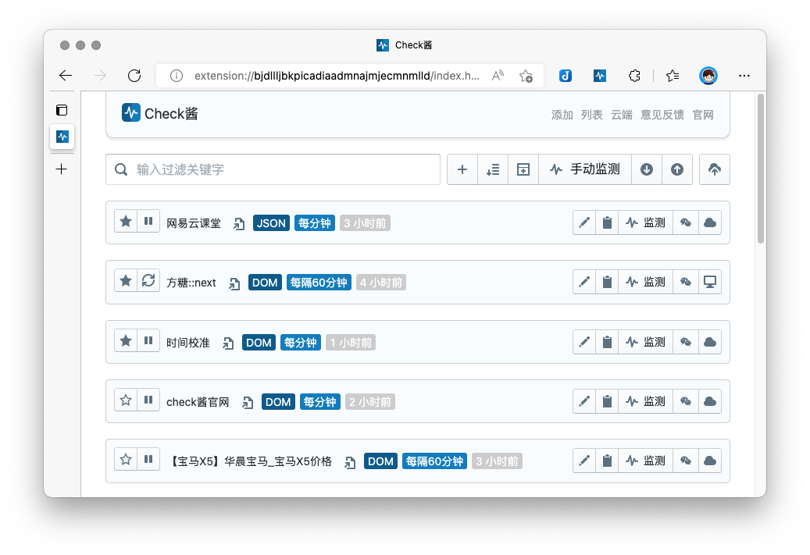
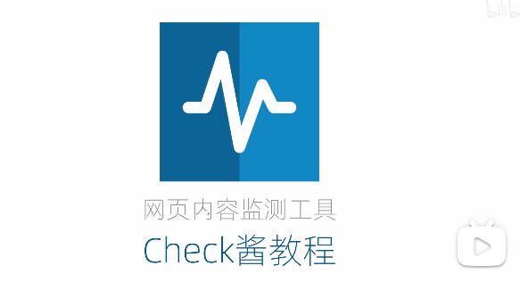
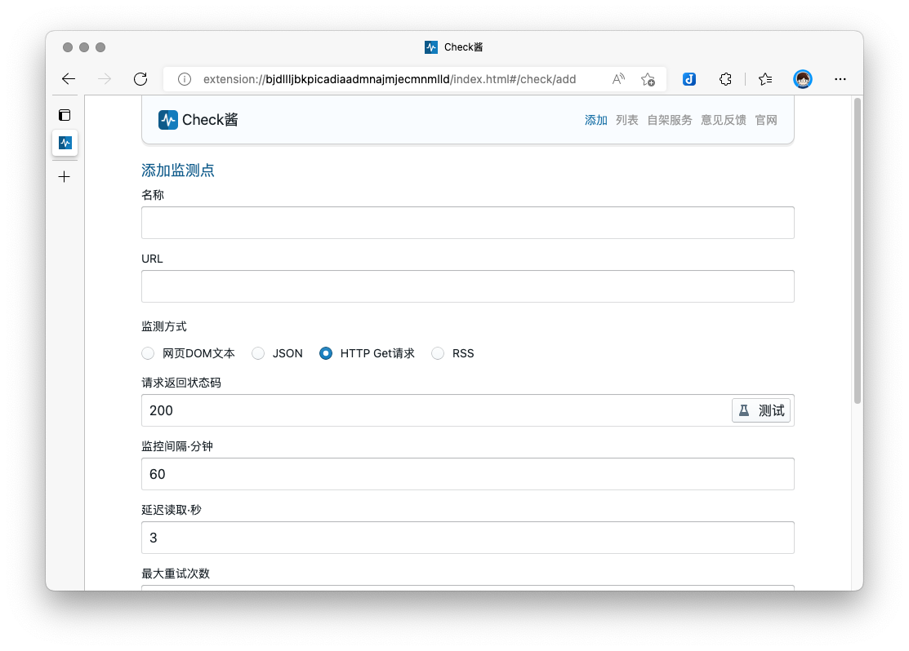
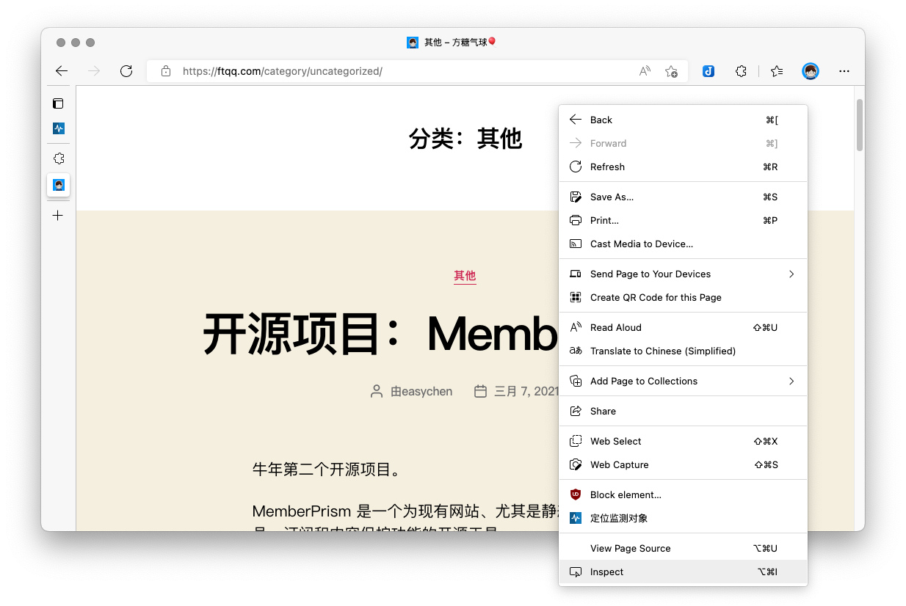
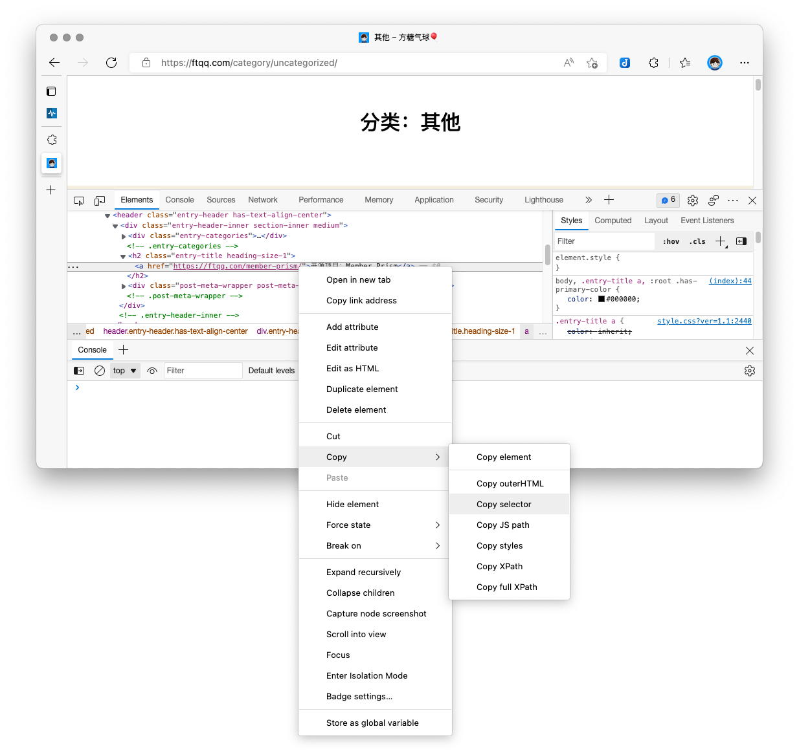
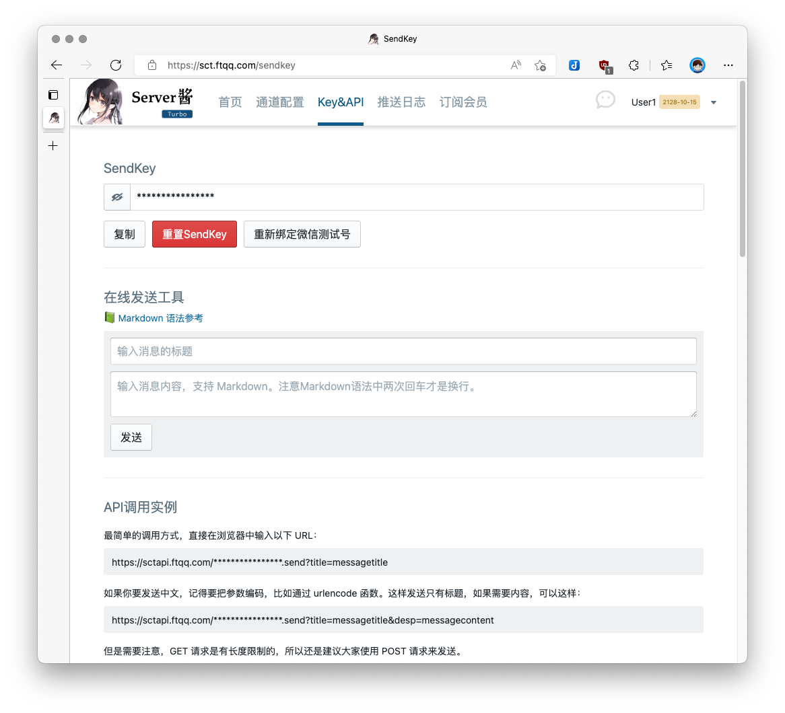
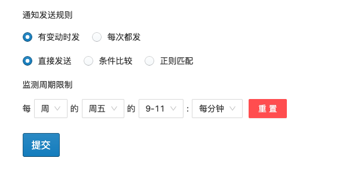
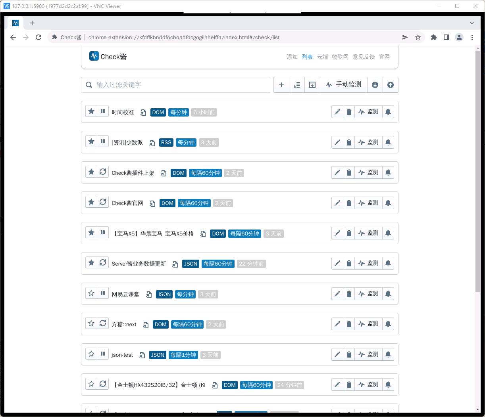

# Check酱

**Check酱是一个通用网页内容监控工具，可以监测网页内容变化，并发送异动到微信**

  

⚠️ docker目录下的代码仅供安全核查和编译多平台镜像，采用附加条件的GPLV3授权：

1. **不得修改或删除**默认对接的Server酱通道。
1. 不得对接**其他消息通道**后再次发布。
1. 满足以上两个条件后，遵从**GPLv3**协议。

## 最新版本

- 插件·Chrome/Edge：2022.06.02.00.06 [下载](ckc.zip)
- Docker镜像(云端+远程桌面二合一)：2022.06.01.23.26 [Docker Hub](https://hub.docker.com/repository/docker/easychen/checkchan)
- 文档：2022.06.02.01.18
- 更新日志：[GitHub](https://github.com/easychen/checkchan-dist/commits/main)

自架云端 Docker 命令（ 将`API Key`从`YouRAPiK1`替换成`任意你想要的安全密码不要带$`）:

```bash
docker run -e API_KEY=YouRAPiK1 -e TZ=Asia/Chongqing -e ERROR_IMAGE=NORMAL -p 8088:80 -v $PWD:/data -d ccr.ccs.tencentyun.com/ftqq/checkchan:latest
```
* 特别提醒：后文有详细的安装说明
* 特别提醒1：`/data`挂载的目录需要写权限
* 特别提醒2：此镜像为x86架构，arm架构镜像可[拉取源码](https://github.com/easychen/checkchan-dist/tree/main/docker)自行构建

## 官方视频教程

[](https://www.bilibili.com/video/BV1K94y1m7tt)

[详细版，近2小时](https://www.bilibili.com/video/BV1K94y1m7tt)

## 什么是「Check酱」

 

Check酱是方糖气球出品的网页内容监测工具，它包含一个Edge/Chrome**浏览器插件**和可以自行架设的**云端**。

基于浏览器插件，它通过**可视化选择器**理论上可以监控网页上的任意内容（文本）、除了浏览器通知，还可以配合[Server酱](https://sct.ftqq.com)将异动推送到微信或手机。

  

Check酱的原理是，通过浏览器插件后台打开网页进行监测，从而**完全模拟用户的真实行为**，可以监控绝大部分复杂的动态网页，需要登录的各种后台页面，并（在绝大多数情况下）自动延续登录态。

除了支持网页内容（Dom）的监测，还支持HTTP状态（通过GET监测）、JSON和RSS方式。

  

配合可以自行架设的**云端**，可以将监测任务同步到服务器，这样当浏览器和电脑关掉以后，监测任务依然可以定时运行。

  


## 插件的安装和使用

插件可以独立使用，只是关掉后定时监测任务不执行。

### 安装

> 目前Check酱正在内测，尚未上架Edge商店，只能通过手工方式载入

下载[插件ZIP包](ckc.zip)，解压为目录（后文称其为A）。

打开Edge的插件页面，打开「开发者模式」，点击「Load Unpacked」，选择上边解压得到的目录A。

  

成功载入的话，就可以看到Check酱界面了。如果失败，通常是因为解压时多了一层目录导致的，可以试试重新选择A目录的下一级目录


### 使用

#### 添加网页监控点

安装插件后，打开要监控的网页，在网页上点击右键，可以看到「定位监测对象」一项。

 

点击后，开始初始化可视化选择器。

  

移动鼠标可以看到高亮区域，放到要监控的文字上点击鼠标左键。

> 注意，选择区域必须包含文本，否则会返回空。有很多文本是印在图片上的，这种也会返回空。

  

将转向到添加页面。

  

可以修改名称、设置监控间隔时间、延迟、最大重试次数。在保存之前，最好点击`CSS选择器路径`一栏后的`测试`按钮进行测试。

如果提示「检测内容为空」，说明存在问题。再次点击进行观察：

如果发现页面打开后favicon没有出来就关了，可以增加「延迟读取」的秒数；如果打开后还是返回空，那么刚才自动生成的选择器路径可能不正确。

可以更换为浏览器自动生成的，方法如下：

① 在要检测的文本上点右键，选择「inspect/审查元素」

  

② 这时候会自动打开开发者工具，并自动选中源码中元素的对应行。在高亮的行上点击右键，选择「复制/Copy」→ 「复制选择器/Copy selector」

  

③ 将复制到的剪贴板的路径填入到「CSS选择器路径」一行后，再次点击「测试」按钮进行测试。

测试通过后，点击「提交」保存监测点。

#### 通过Server酱推送到微信和其他设备

  

在添加和修改监测点时，填入Sendkey即可将消息推送到Server酱。

##### 如何获得 SendKey

登录[Server酱官网](https://sct.ftqq.com)，进入「[Key&API](https://sct.ftqq.com/sendkey)」，点击「复制」按钮即可。

  

##### 如何推送到其他通道

登录[Server酱官网](https://sct.ftqq.com)，进入「[通道配置](https://sct.ftqq.com/forward)」，选择要推送的通道，并按页面上的说明进行配置。可以将消息推送到「PushDeer」和各种群机器人。

  

如果以上通道不能满足你的需要，可以选择「自定义」通道，发送自定义的http请求。此方式可以兼容绝大部分通知接口。

  

### 导入和导出全部监控点

点击监控点列表右上方的向上和向下箭头可以导入和导出全部监控点。

  

### 分享和导入监控点

点击监控点列表中的「剪贴板」，可以将当前监控点的设置导出到剪贴板。

  

导出数据类似这样：

```
checkchan://title=Server%E9%85%B1%E5%AE%98%E6%96%B9%E7%BD%91%E7%AB%99%E7%8A%B6%E6%80%81&url=https%3A%2F%2Fsct.ftqq.com&type=get&code=200&rss_field=title&delay=3&retry=10
```

复制以上字符后，在Check酱浏览器插件界面通过Ctrl+V粘贴，会自动识别并跳转到「添加监测点」界面。

 

### 监测周期限制

有些任务只需要在特定的时间段执行，为了节省资源，我们添加了「监测周期限制」功能。比如某动画每周五上午十点更新，那么我们可以将「监测周期限制」设置如下：

  

这样其他时间段就不再启动监测。对于无法预知事件段的任务，使用默认的「每分钟」即可。

注意在「监测周期限制」之上，还有「监控间隔时间」。

  

如果 「监测周期限制」 为每分钟，而「监控间隔时间」为60分钟，那么每分钟都会尝试监测，而一旦监测成功一次，那么下次监测将是60分钟后。

同时，因为执行监测任务本身也耗费时间，所以「监控间隔时间」为1分钟时，往往每隔一分钟（即每两分钟）才会运行一次任务。

### 日志查看和错误定位

为了更清楚的了解定时任务的执行情况，你可以打开「开发者工具」（F12）在 `Console` 标签页中可以看到任务产生的日志。

  

错误信息也会在这里以红色高亮的行显示，遇到Bug时提供日志错误截图可以帮助我们更快的定位到问题。

### 更新浏览器插件

上架商店后，可以自动升级，在此之前需要手动升级。升级方式为下载zip包解压后覆盖原有文件，再在浏览器的插件管理面板中「reload」一下。

  


## 自架云端的安装和使用

配合自行架设的服务器，可以将任务同步到云端执行，即使关掉浏览器和电脑后监测任务也会一直运行。

> ⚠️ 特别说明：因为云端的网络、环境都和本机不同，所以并不保证本机能运行的任务都能在云端运行成功，一些复杂网页和有较多动态效果的网页可能失败。


### 安装

> 架设自架版云端需要技术基础，非技术用户建议购买我们的官方版云端（将在内测完成后发布）

为方便安装，自架版云端需要docker环境。如果你没有云服务器，可以看看[腾讯云30~50元首单的特价服务器](https://curl.qcloud.com/VPjlS4gj)。

#### 通过 Docker-compose 启动

登录服务器（假设其IP为IPB），在要安装的目录下，新建一个 `docker-compose.yml` 文件，复制张贴下边的内容：

```yaml
version: '2'
services:
  api:
    image: ccr.ccs.tencentyun.com/ftqq/checkchan:latest
    volumes:
      - './:/data'
    ports:
      - '8088:80'
    environment:
      - API_KEY=<这里写一个你自己想的API_KEY>
      - ERROR_IMAGE=NORMAL # NONE,NORMAL,FULL
      - SNAP_URL_BASE=<开启截图在这里写服务器地址，不开留空> #如 http://ip.com/
      - SNAP_FULL=1 #完整网页长图
      - TZ=Asia/Chongqing
```

将其中 `<这里写一个你自己想的API_KEY>` 换成一个别人不知道的密码（下文称密码C
）。注意不要包含`$`字符，替换完后也不再有两边的尖括号`<>`。

保证Docker用户对此目录有写权限，并在同一目录下运行以下命令：

```bash
docker-compose up -d
```

> 如提示docker服务未安装/找不到/未启动，可在 docker-compose 前加 sudo 再试

等待初始化完成后，访问 `http://$BBB:8088?key=$CCC`( 将$BBB替换为IP B，$CCC替换为密码C )，看到包含 `it works` 的提示即为架设成功。

 

#### 通过 Docker 启动

```bash
docker run -e API_KEY=* -e TZ=Asia/Chongqing -p 8088:80 -v $PWD:/data -d ccr.ccs.tencentyun.com/ftqq/checkchan:latest
```

请将上述命令中的*替换为对应的数据库信息。

#### 更新镜像

Check酱云端镜像更新后，你可以将正在运行的云端服务升级到最新版。方式如下：

首先停现有的容器：

通过 docker-compose 启动的运行：

```bash
docker-compose down
```

通过 docker 直接启动的运行 `docker ps` 查询到容器id，通过 `docker stop 容器id` 停止。

然后运行 docker pull 拉取最新版：

```bash
docker pull ccr.ccs.tencentyun.com/ftqq/checkchan:latest
```

完成后再启动服务即可。

### 将浏览器插件对接云端

 

点击插件右上方菜单中的`云端服务`。

在`服务器地址`一栏输入 `http://$BBB:8088`(将$BBB替换为IP B，这里的URL不用加key参数)；在`API_KEY`一栏输入密码C。

点击保存，连接成功后，配置完成。

### 同步本地任务到云端

配置好云端以后回到列表页，每行最右边会多出来一个「电脑」图标，点击后会变成「云」图标，该任务将改为在云端执行。

  

点击右上角 「云+箭头」的按钮，可以主动同步任务到云端。

 

Check酱也会每十分钟自动同步一次。

### 云端截图

Check酱自架云端支持对网页（dom）类型任务进行截图，可以通过给镜像传递环境变量来开启：

- SNAP_URL_BASE=<开启截图在这里写服务器地址，不开留空> #如 http://ip.com/
- SNAP_FULL=1 #完整网页长图

可参考上文的`docker-compser.yml`。添加环境变量后重启服务即可。

注意

- 截图功能需要较大的内存，部分服务器可能会报错
- 云端网络和本地不同，可能会超时失败，请适当增加延时，并将取消完整截图

### 云端任务的安全性

Check酱云端任务的原理是将cookie同步到云端，然后用浏览器查看，本质和用户操作一样。但因为出口IP可能是机房和数据中心，频次太高也有被风控的可能。如果将云端部署在家里，则和在家用电脑访问效果一样。


### 云端错误排查

通常来讲，出现本地任务可以执行，云端不能执行的问题，是因为两者网络环境、浏览器软件存在差异，比如：

1. 页面结构每次都会变动：比如一些网站的首页，建议进入分类列表页面选择监控点
1. 电脑网络和云端网络不同：在浏览器中可以访问的内容，在数据中心可能访问不到
1. CDN更新延迟：电脑和云端CDN节点刷新未完成，会造成一边可用一边不可用，等待更新完成后再监控
1. 浏览器插件改变了网页结构：比如本地通过 AdBlock 过滤了广告，但云端没有，造成结构不同，监测失败


由于服务器内存通常没大家电脑大，所以很多在本地执行OK的任务同步到云端后会因为「延迟读取」秒数太小中途停止而失败。如果遇到类似情况，请尝试增加「延迟读取」。

  

如果这样也不行，往往是因为云端无头浏览器显示网页和本地存在差异导致，我们为这种情况生成了最近一次失败的任务的截图，可以在「云端服务」菜单下看到。

  

点击「失败截图」按钮即可看到。注意：需要只用最新的镜像，并传递`ERROR_IMAGE=NORMAL` 环境变量。如果希望截取完整网页的图片，可以传递`ERROR_IMAGE=FULL`。

如果任务失败又没有截图，说明该任务不是因为CSS选择器未命中而失败，尝试增加「延迟读取」可能解决。

这个页面也能看到云端任务日志，这里的日志不包含手动点击「监测」按钮触发的任务。如果没有可以执行的任务（任务是定时触发的），那么日志亦可能为空。

## 远程桌面版

  

除了自架云端，我们还在镜像中集成了远程桌面模式。它让你可以通过VNC连接服务器，像使用本地浏览器一样使用。

> 远程桌面版本之前为一个独立镜像，现在已经整合到 easychen/checkchan 中，只是启动时端口、参数有所不同。

### 创建数据目录

为了重新启动镜像后，我们在其中的操作数据可以保存，我们需要创建一个数据目录用于存放用户数据。

在当前目录创建 `user_data` 目录: 

```bash
mkdir user_data && chmod -R 755 user_data
```

然后运行以下命令启动镜像：

```bash
docker run -d -p 5900:5900 -v ${PWD}/user_data:/home/chrome/user_data -e CKC_PASSWD=123 --cap-add=SYS_ADMIN easychen/checkchan:latest
```

此后在镜像的浏览器中进行的操作结果均会保存下来。

### 通过 VNC 连接使用

服务启动后，可以通过 VNC 客户端软件进行连接使用。

- 连接地址: 架设服务的IP:5900
- 密码: 123 （可自行修改命令调整）


### 移动版

可以添加环境变量，修改屏幕宽高限制，使其在手机上更好用:

```bash
docker run -d -p 5900:5900 -v ${PWD}/user_data:/home/chrome/user_data -e CKC_PASSWD=123 -e WIN_WIDTH=414 -e WIN_HEIGHT=896 -e XVFB_WHD=500x896x16 --cap-add=SYS_ADMIN easychen/checkchan:latest
```


### 特别说明

内存较大的运行环境会比较稳定，如果遇到问题可尝试加大内存。

### 同时使用云端和远程桌面

新建目录 `data`，并使其可写：

```bash
mkdir data && chmod 0777 data
```

然后将以下内容按需调整后保存为 `docker-compose.yml`：

```yml
version: '3'
services:
  chrome:
    build: ./
    cap_add:
      - SYS_ADMIN
    volumes:
      - "./data/config:/home/chrome/config"
      - "./data/app_data:/home/chrome/app_data"
      - "./data/user_data:/home/chrome/user_data"
    environment:
      - "CKC_PASSWD=123"
      - "HEADLESS=true"
      #- "WIN_WIDTH=414"
      #- "WIN_HEIGHT=896"
      #- "XVFB_WHD=500x896x16"
      - "API_KEY=aPiKe1"
      - "ERROR_IMAGE=NORMAL" # NONE,NORMAL,FULL
      #- "SNAP_URL_BASE=http://..."
      #- "SNAP_FULL=1"
      - TZ=Asia/Chongqing
    ports:
      - "5900:5900" 
      - "8080:8080" 
      - "8081:80"
```

运行以下命令启动：

```
docker-compose up -d
```

服务所在的端口为：

- 云端：8081
- 远程桌面(VNC): 5900
- 远程桌面的Web界面(NoVNC): 8088

在远程桌面中，可以直接连接同一个容器内的云端，服务器地址填 `http://localhost`，API KEY按上边 YML 中设置的输入即可。

使用同一个镜像中集成的云端可以对云端任务进行可视化调试，将 YML 文件中的 `HEADLESS` 一行注释掉，再重新启动容器即可看到云端监测网页的详细过程。

```yml
environment:
  - "CKC_PASSWD=123"
  #- "HEADLESS=true"
```

